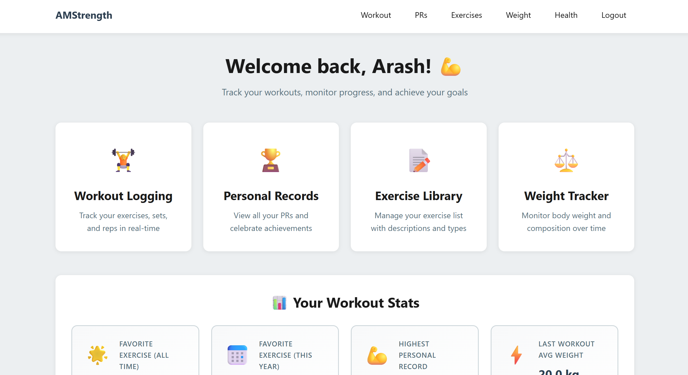
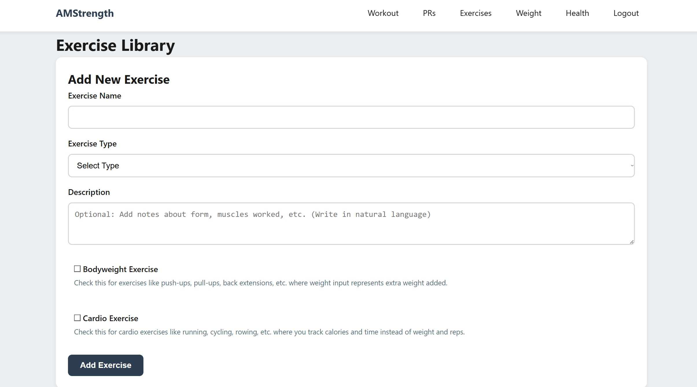
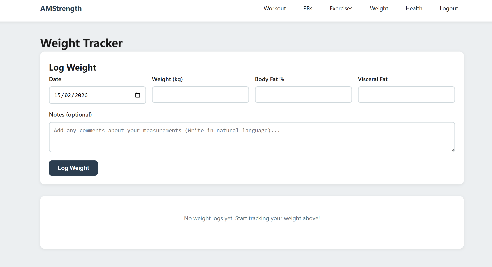

# Workout_Logging_App
A lightweight workout logging app for personal use.

## Features

- **Workout Logging**: Track exercises, sets, reps, and weights in real-time
- **Personal Records (PRs)**: View all your personal records for each exercise
- **Workout Programs**: Create and manage custom workout programs (Upper/Lower, PPL, etc.)
- **Weight Tracker**: Monitor body weight, body fat percentage, and visceral fat with visual graphs
- **Secure Login**: Password-protected access to your personal data
- **Mobile-Optimized**: Responsive design that works great on mobile and desktop

## Setup

### Local Development

1. Clone the repository:
```bash
git clone https://github.com/Arashi20/Workout_Logging_App.git
cd Workout_Logging_App
```

2. Create a virtual environment and install dependencies:
```bash
python -m venv venv
source venv/bin/activate  # On Windows: venv\Scripts\activate
pip install -r requirements.txt
```

3. Create a `.env` file based on `.env.example`:
```bash
cp .env.example .env
```

4. Edit `.env` with your configuration:
```
DATABASE_URL=sqlite:///workout.db  # For local development
SECRET_KEY=your-secret-key-here
ADMIN_USERNAME=your-username
ADMIN_PASSWORD=your-password
```

5. Initialize the database and create admin user:
```bash
flask init-db
flask create-admin
```

**Note**: If you make changes to the database models and need to update the schema:
```bash
flask migrate-schema  # Automatically adds missing columns (preserves data)
# OR
flask reset-db  # WARNING: This drops all tables and recreates them, deleting all data!
```
The `migrate-schema` command is recommended as it preserves your data, while `reset-db` is useful for testing/development when you don't mind losing test data.

6. Run the application:
```bash
python app.py
```

Visit `http://localhost:5000` in your browser.

### Railway Deployment

1. Create a new project on Railway
2. Add a PostgreSQL database to your project
3. Set environment variables in Railway:
   - `SECRET_KEY`: A random secret key
   - `ADMIN_USERNAME`: Your desired username
   - `ADMIN_PASSWORD`: Your desired password
   - `DATABASE_URL`: Automatically set by Railway PostgreSQL

4. Deploy from GitHub:
   - Connect your repository
   - Railway will automatically detect the Procfile and deploy

5. Initialize the database (run in Railway console):
```bash
flask init-db
flask create-admin
```

6. **Database Schema Updates**: 

   **Option 1 - Automatic Migration (RECOMMENDED)**:
   Run the built-in migration command to update your database schema:
   ```bash
   flask migrate-schema
   ```
   This command will:
   - Check your current database schema
   - Add any missing columns (like `is_bodyweight`)
   - Display what changes were made
   - Preserve all your existing data
   
   **Option 2 - Quick Reset (for testing/development, deletes all data)**:
   If you're testing the app and don't mind losing data, the simplest approach is to reset the database:
   ```bash
   flask reset-db  # WARNING: Drops all tables and recreates them with current schema
   ```

   **Option 3 - Manual Migration Scripts (legacy method)**:
   If you prefer to run migration scripts directly:
   ```bash
   python migrate_add_indexes.py
   python migrate_add_bodyweight.py
   ```

   These migrations add:
   - `migrate_add_indexes.py`: Critical database indexes that significantly improve performance
   - `migrate_add_bodyweight.py`: The `is_bodyweight` column to the exercises table

   **Note**: All migration methods are idempotent (safe to run multiple times).
   
   **Troubleshooting**: If you encounter database schema issues, see [DATABASE_MIGRATION_GUIDE.md](DATABASE_MIGRATION_GUIDE.md) for detailed troubleshooting steps.

### Performance Optimization

The app includes several performance optimizations for production use:

1. **Database Indexes**: Foreign key columns are indexed to speed up queries
2. **Connection Pooling**: Configured with optimal pool sizes for concurrent requests
3. **Connection Recycling**: Connections are recycled every hour to prevent stale connections
4. **Pre-ping**: Database connections are verified before use to catch connection issues early

If you experience slow performance or worker timeouts after deployment, ensure you've run the migration script to add the indexes.

## Usage

1. Log in with your username and password
2. Start a workout session from the Workout tab
3. Add exercises with sets, reps, and weights
4. Finish the workout to save your session with total duration
5. View your personal records in the PRs tab
6. Create workout programs in the Programs tab
7. Track your weight and body composition in the Weight Tracker tab

## Tech Stack

- **Backend**: Flask (Python)
- **Database**: PostgreSQL (production) / SQLite (development)
- **Frontend**: HTML, CSS, Vanilla JavaScript
- **Charts**: Chart.js
- **Deployment**: Railway 

## Example Screenshots







