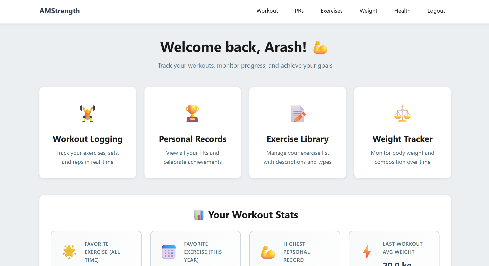
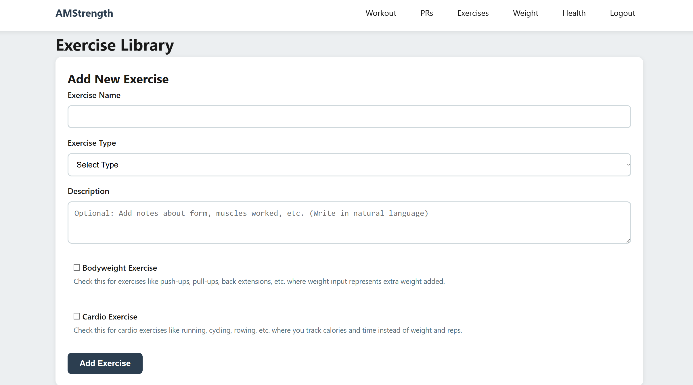
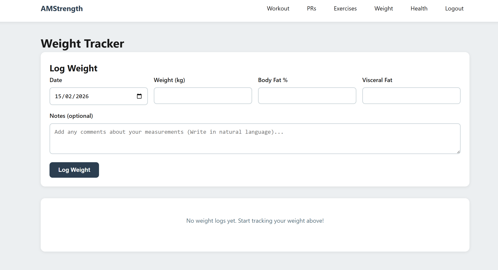

# Workout Logging App

## About This Project

I wanted to create a workout logging app for personal use so I could log my weekly workouts, gather the data, and eventually perform predictive analyses on it in the future.

This is a lightweight, mobile-optimized web application built with Flask that helps you track your fitness journey through workout logging, personal records, and body composition monitoring.

## Features

- **Workout Logging**: Track exercises, sets, reps, and weights in real-time
- **Personal Records (PRs)**: View all your personal records for each exercise
- **Weight Tracker**: Monitor body weight, body fat percentage, and visceral fat with visual graphs
- **Secure Login**: Password-protected access to your personal data
- **Mobile-Optimized**: Responsive design that works great on mobile and desktop

## Setup

### Local Development

1. Clone the repository:
```bash
git clone https://github.com/Arashi20/Workout_Logging_App.git
cd Workout_Logging_App
```

2. Create a virtual environment and install dependencies:
```bash
python -m venv venv
source venv/bin/activate  # On Windows: venv\Scripts\activate
pip install -r requirements.txt
```

3. Create a `.env` file based on `.env.example`:
```bash
cp .env.example .env
```

4. Edit `.env` with your configuration:
```
DATABASE_URL=sqlite:///workout.db  # For local development
SECRET_KEY=your-secret-key-here
ADMIN_USERNAME=your-username
ADMIN_PASSWORD=your-password
```

5. Initialize the database and create admin user:
```bash
flask init-db
flask create-admin
```

**Database Schema Updates**: If you make changes to the database models in `models.py` and need to update the schema, you have two options:

- **Recommended** - Preserve your data:
  ```bash
  flask migrate-schema
  ```
  This command automatically adds missing columns to your database while preserving all existing data.

- **Testing/Development only** - Fresh start:
  ```bash
  flask reset-db
  ```
  ⚠️ **WARNING**: This drops all tables and recreates them from scratch, **deleting all data**! Only use this during testing/development when you don't mind losing data.

6. Run the application:
```bash
python app.py
```

Visit `http://localhost:5000` in your browser.

## Railway Deployment

This application is designed to be easily deployed on Railway with PostgreSQL.

1. Create a new project on Railway
2. Add a PostgreSQL database to your project
3. Set environment variables in Railway:
   - `SECRET_KEY`: A random secret key
   - `ADMIN_USERNAME`: Your desired username
   - `ADMIN_PASSWORD`: Your desired password
   - `DATABASE_URL`: Automatically set by Railway PostgreSQL

4. Deploy from GitHub:
   - Connect your repository
   - Railway will automatically detect the Procfile and deploy

The database is automatically initialized on first startup. When the app starts, it will:
- Create all necessary database tables
- Create the admin user with the credentials you specified in the environment variables

### Updating Database Schema in Production

If you make changes to the database models and need to update the schema in production:

**Option 1 - Automatic Migration (RECOMMENDED)**:
Run this command in the Railway console to add new columns while preserving your data:
```bash
flask migrate-schema
```
This command will:
- Check your current database schema
- Add any missing columns or tables
- Preserve all your existing data
- Display what changes were made

**Option 2 - Reset Database (for testing only)**:
⚠️ **WARNING**: This will delete all data!
```bash
flask reset-db
```
This drops all tables and recreates them with the current schema. Only use this during initial testing when you don't have production data yet.

### Performance Optimization

The app includes several performance optimizations for production use:

- **Database Indexes**: Foreign key columns are automatically indexed to speed up queries
- **Connection Pooling**: Configured with optimal pool sizes for concurrent requests
- **Connection Recycling**: Connections are recycled every 5 minutes to prevent stale connections
- **Pre-ping**: Database connections are verified before use to catch connection issues early
- **Statement Timeout**: PostgreSQL queries have a 30-second timeout to prevent hanging queries

## Read-Only API & MCP Connector (for Claude)

The app exposes a **read-only** layer so a chatbot can look at your data without
being able to change it. Four areas are exposed: **weight**, **discipline**,
**nutrition** and **PRs**. There is no write tool and no write endpoint - the
whole layer only issues SELECTs.

Two ways in, both served by the same code:

| Surface | Endpoint | Auth |
|---|---|---|
| MCP (Claude custom connector) | `POST /mcp` | OAuth 2.1, or a static token |
| Plain REST (scripts, curl) | `GET /api/v1/...` | Static bearer token |

### Environment variables (set these in Railway)

| Variable | Required | What it does |
|---|---|---|
| `API_READ_TOKEN` | for REST | Static bearer token(s) for the read API. Comma-separate to rotate. Generate with `python -c "import secrets; print(secrets.token_urlsafe(32))"` |
| `MCP_PUBLIC_URL` | recommended | Public https URL of the deployment, e.g. `https://your-app.up.railway.app`. Falls back to Railway's `RAILWAY_PUBLIC_DOMAIN`. |
| `MCP_ENABLED` | no | `0` turns the `/mcp` endpoint off. Default on. |
| `MCP_OAUTH_ENABLED` | no | `0` turns the OAuth endpoints off. Default on. |
| `MCP_OAUTH_ALLOW_DYNAMIC_REGISTRATION` | no | `0` requires a pre-shared client instead of letting Claude register itself. Default on. |
| `MCP_OAUTH_CLIENT_ID` / `MCP_OAUTH_CLIENT_SECRET` | no | A pre-shared OAuth client, if you would rather paste credentials into Claude than use dynamic registration. |
| `MCP_OAUTH_REDIRECT_URIS` | no | Comma-separated callbacks allowed for that pre-shared client. Defaults to Claude's `https://claude.ai/api/mcp/auth_callback` and the `claude.com` equivalent. |
| `API_USER` | no | Which account the API reads. Defaults to `ADMIN_USERNAME`. |

Tokens are HMAC-signed with `SECRET_KEY` rather than stored in the database, so
no migration is needed - and changing `SECRET_KEY` revokes every issued token.

### Connecting Claude

1. Deploy, and make sure `MCP_PUBLIC_URL` is set.
2. In Claude: **Settings -> Connectors -> Add custom connector**.
3. Enter the MCP server URL: `https://your-app.up.railway.app/mcp`.
4. Leave the OAuth client ID/secret fields blank - Claude registers itself
   automatically. (If you prefer to fill them in, set `MCP_OAUTH_CLIENT_ID` and
   `MCP_OAUTH_CLIENT_SECRET` in Railway first and paste the same values.)
5. Click **Connect**. A login page appears: enter your app username and
   password, approve, and Claude gets a read-only token.

For Claude Code, the static token is simpler:

```bash
claude mcp add --transport http workout-log https://your-app.up.railway.app/mcp \
  --header "Authorization: Bearer $API_READ_TOKEN"
```

### MCP tools

| Tool | Returns |
|---|---|
| `get_weight` | Weight / body fat / visceral fat history and the change over the window |
| `get_discipline` | Current streak, best streak, total clean days, milestones, past attempts |
| `get_nutrition` | Today's protein entries and total vs target, per-day totals, 30-day average, presets |
| `get_personal_records` | Current PR per exercise grouped by type, with an estimated 1RM |

### REST endpoints

```bash
curl -H "Authorization: Bearer $API_READ_TOKEN" https://your-app.up.railway.app/api/v1/ping
curl -H "Authorization: Bearer $API_READ_TOKEN" "https://your-app.up.railway.app/api/v1/weight?limit=30"
curl -H "Authorization: Bearer $API_READ_TOKEN" "https://your-app.up.railway.app/api/v1/discipline?limit=20"
curl -H "Authorization: Bearer $API_READ_TOKEN" "https://your-app.up.railway.app/api/v1/nutrition?days=7"
curl -H "Authorization: Bearer $API_READ_TOKEN" "https://your-app.up.railway.app/api/v1/prs?exercise=bench"
```

Anything other than `GET` returns `405`.

## Usage

1. Log in with your username and password
2. Start a workout session from the Workout tab
3. Add exercises with sets, reps, and weights
4. Finish the workout to save your session with total duration
5. View your personal records in the PRs tab
6. Create workout programs in the Programs tab
7. Track your weight and body composition in the Weight Tracker tab

## Tech Stack

- **Backend**: Flask (Python)
- **Database**: PostgreSQL (production) / SQLite (development)
- **Frontend**: HTML, CSS, Vanilla JavaScript
- **Charts**: Chart.js
- **Deployment**: Railway 

## Example Screenshots







